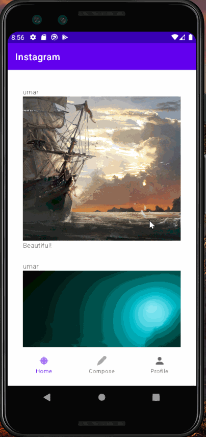

# Finstagram
Finstagram is a photo sharing app similar to Instagram, but made from scratch with a full backend and frontend.
**V1** was an implementation of the backend and a basic frontend to set up the site. 
**V2** brings in a fully working backend and frontend, with options to post pictures, videos, comments, and profile viewing!
**V3** is currently in the works and will add: better, fluid UI/UX similar to Instagram, reduced latency timings for accessing the app by hosting on Heroku, and a "Explore" feature!

Time spent: **20** hours spent in total

## User Stories

The following **required** functionality is completed:

- [X] User can sign up to create a new account using Parse authentication.
- [X] User can log in and log out of his or her account.
- [X] The current signed in user is persisted across app restarts.
- [X] User can take a photo, add a caption, and post it to "Instagram".

The following **optional** features are implemented:

- [X] User sees app icon in home screen and styled bottom navigation view
- [ ] Style the feed to look like the real Instagram feed.
- [X] After the user submits a new post, show an indeterminate progress bar while the post is being uploaded to Parse.

## Video Walkthrough

Here's a walkthrough of implemented user stories:

## Notes

V3 in the works, scheduled deploy date is in early May/June

## Open-source libraries used

- [Android Async HTTP](https://github.com/codepath/CPAsyncHttpClient) - Simple asynchronous HTTP requests with JSON parsing
- [Glide](https://github.com/bumptech/glide) - Image loading and caching library for Android

## License

    Copyright [2021] [Umar Kagzi]

    Licensed under the Apache License, Version 2.0 (the "License");
    you may not use this file except in compliance with the License.
    You may obtain a copy of the License at

        http://www.apache.org/licenses/LICENSE-2.0

    Unless required by applicable law or agreed to in writing, software
    distributed under the License is distributed on an "AS IS" BASIS,
    WITHOUT WARRANTIES OR CONDITIONS OF ANY KIND, either express or implied.
    See the License for the specific language governing permissions and
    limitations under the License.
